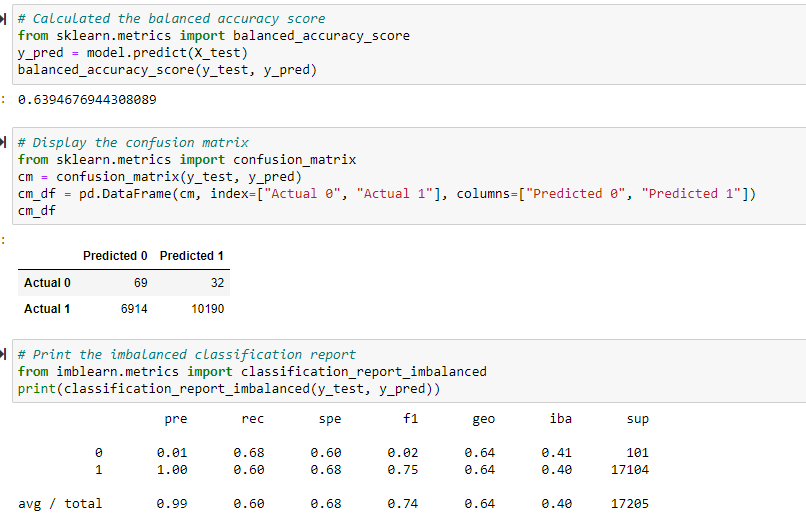
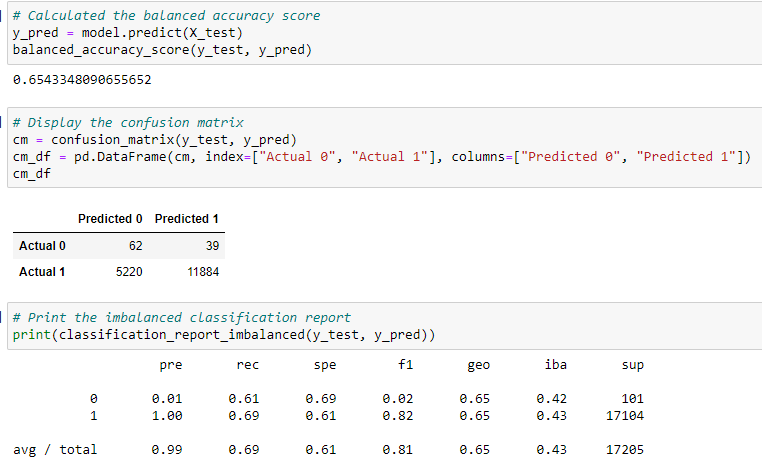
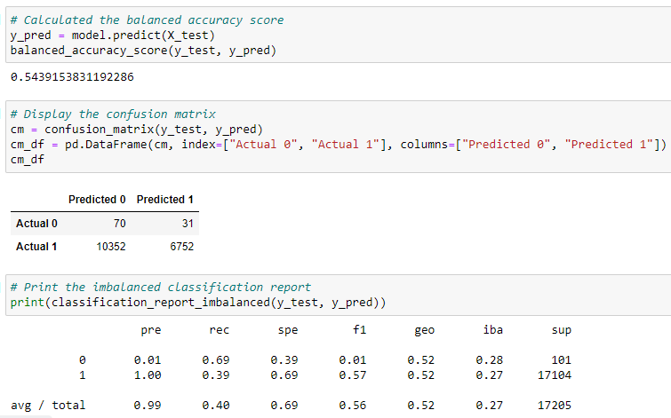
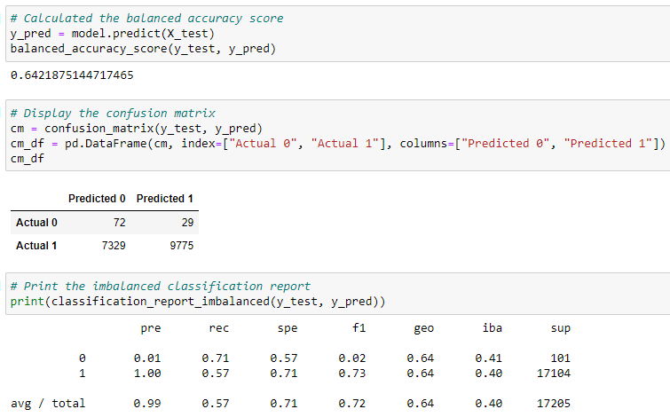
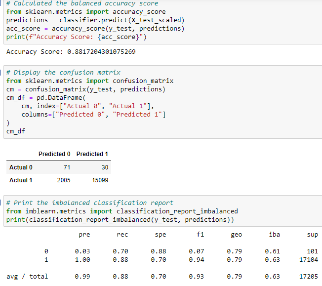
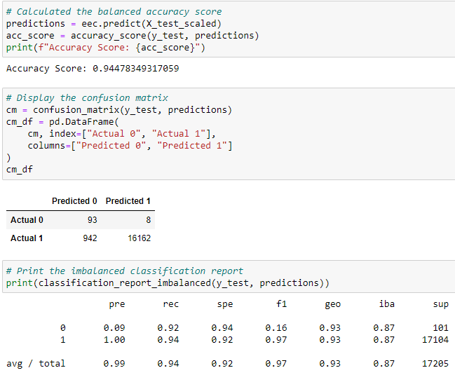

# Credit_Risk_Analysis

## Overview of Credit Risk Analysis

### Purpose
The purpose for this project was to help the company LendingClub evaluate credit card data by using supervised machine learning to predict credit risk. Their team believes this will provide a quicker and more reliable lending experience and can also help identify good candidates to provide loans for, which will lower the risk of the loan defaulting. To achieve this several different machine learning models were built using various data processing techniques to determine how well these methods predicted the credit risk data. After evaluating the results, a recommendation can be provided if there is a model that performed well in predicting which applicants should receive the loan.  

## Credit Risk Results

### Supervised ML Models Performances
- As shown in the below screenshot, the random oversampling technique used on the logistic regression model performed at a 64% accuracy score for predicting results from our testing dataset. The precision of the majority class of low risk applicants was close to perfect, but it was the opposite for the minority class of high risk applicants at 1%. The recall score was similar for both classes, with the edge going to the minority class at 68%. 

- The synthetic minority oversampling technique (SMOTE)used on the logistic regression model performed at a 65% accuracy score for predicting results from our testing dataset. Once again, the precision of the majority class of low risk applicants was close to perfect, but it was the opposite for the minority class at 1%. Here the recall score was again similar for both classes, but the edge went to the majority class at 69%. 

- The cluster centroids undersampling technique was used on the logistic regression model and this performed at a 54% accuracy score for predicting results from our testing dataset. The trend of the precision score for the majority class being close to perfect while the opposite showed for the minority class carried over here as well. For the recall score the minority class had the clear edge in this model at 69% while the majority class returned a score of 39%. 

- Shown below is a sampling technique that is a combination of oversampling and undersampling in SMOTEENN which combines SMOTE with Edited Nearest Neighbors (ENN) algorithms, on the logistic regression model and this performed at a 64% accuracy score. The trend for the precision scores was evident in this model as well, where the majority class was close to perfect and it was the opposite for the minority class. Up to this point the recall score for the minority class showed the highest at 71% while the majority class had a recall score at 57%. 

- A new model is tried now which requires scaling the features in order to use an ensemble algorithm. First used is the balanced random forest classifier which returned a high accuracy score at 88%. For this model the precision score for the minority class had a very slight improvement to 3%, while the majority class's precision score was still close to perfect. Both classes recall scores were high for this model with the edge to the majority class at 88%. 

- The final model shown below was the easy ensemble classifier. This model returned the highest accuracy score at 94%. This model also had the highest precision score for the minority class at 9%, and also remained close to perfect for the majority class. This model also returned high recall scores for both classes, where the minority class was at 92% and majority class at 94%. 

## Credit Risk Summary

### Supervised ML Models Takeaways & Recommendation
When working with credit risk data, there is an inherently unbalanced classification problem because good loans easily outnumber risky loans. This was evident across all of our models used and more so in some than others. The precision scores for all models in predicting our minority class of high risk applicants was low because it returned the volume of applicants returned a normal amount of predicted high risk results, but in reality there are not many actual high risk applicants. Most models except the undersampling cluster centroids technique predicted more correct low risk applicants, than incorrectly predicting them as high applicants. The ensemble models performed better than the sampling/logistic regression models, which is first shown from their higher accuracy scores. The classification reports back this up as well where each model matched or had higher precision and recall scores for both the minority and majority classes. 

For a recommendation on which model to use, after reviewing all of the results the best would be the easy ensemble classifier. The goal for LendingClub should be to find a model that ideally helps identify applicants that are high risk candidates to ensure that they are not provided the loan, so the company does not risk providing loans that are likely to default. This model returned a recall score of 92% for the high risk class which means that it was a very strong model for not allowing false negatives to occur, or marking applicants as low risk when really they are high risk. The recall score was also high for the majority class of low risk applicants, signaling that the model is strong for predicting true low risk applicants. The precision score for the minority class was low overall but still the highest among all of the models, and again this can be attributed to the inherently unbalanced classification problem in credit risk data. 

